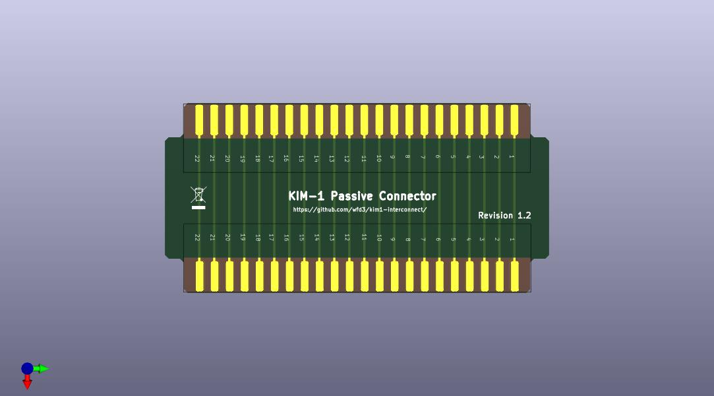

This is a simple passive interconnect that allows the connection of more than one board to a KIM-1 using either the powered or passive breakout connectors.  When ordering from a PCB fabricator, remember to specfify that the board requires edge connectors and the edge connector surface finish of your choice.  Typically, we recommend Hard Gold and a bevel of 20 degrees.

